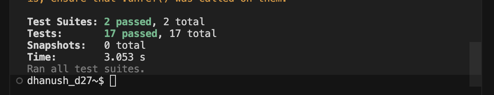

# Car Rental Assignment - Bootcamp 1

A backend API for a car rental system built with Express and TypeScript.

---

## Tech Stack

- **Express** - Web framework for Node.js
- **TypeScript** - Type-safe JavaScript
- **Jest & Supertest** - Testing framework
- **PostgreSQL** - Database (running in Docker container)
- **Drizzle ORM** - Database ORM and communication
- **Bun** - Package manager
- **JWT** - Authentication
- **Bcrypt** - Password hashing

## Getting Started

### Prerequisites

- Bun installed
- Docker (for PostgreSQL)

### Installation

```bash
bun install
```

### Running the Database

```bash
docker-compose up -d
```

### Running the Server

```bash
bun run dev
```

### Running Tests

```bash
bun run test
```

## Learnings

- Revised concepts of TypeScript and server-side code
- Practiced writing tests with Jest and Supertest
- Learnt about Drizzle ORM on the go

## Try It Yourself

You can try this assignment as well: [Car Rental System Backend - PostgreSQL & JWT](https://brindle-goal-102.notion.site/Car-Rental-System-Backend-PostgreSQL-JWT-2a846b36b2e980009dbac0ebe0e9b9a7)

---

## Test Results



---

### Follow me on

- [Twitter](https://x.com/orcatwt)
- [LinkedIn](https://www.linkedin.com/in/dhanush27/)
